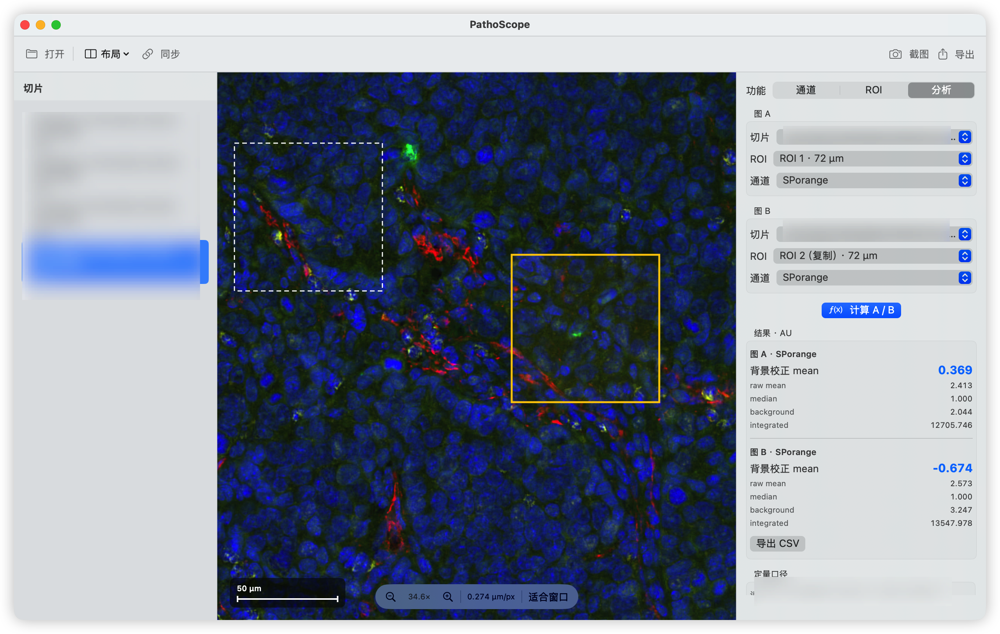
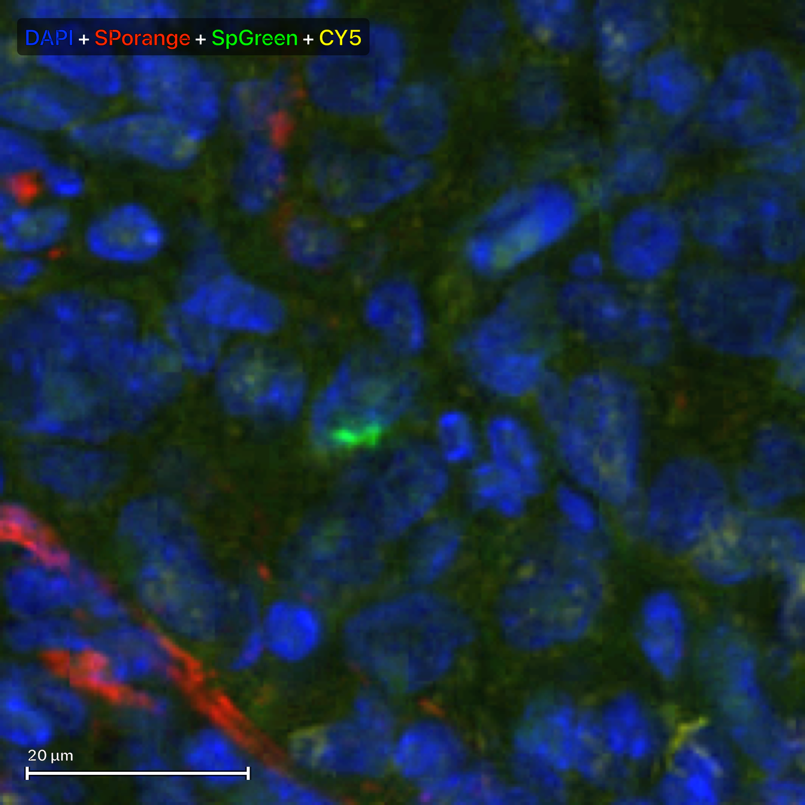
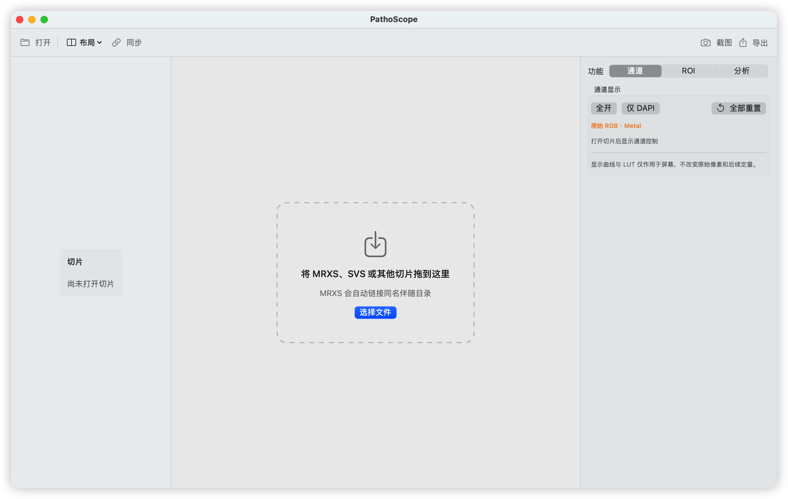
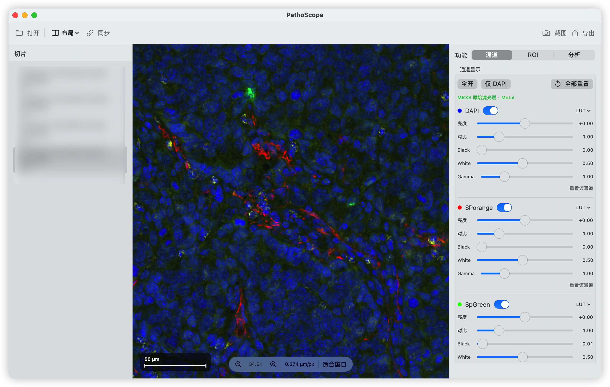

# PathoScope

> A native macOS digital pathology and mIF viewer. Slides are huge; excuses are small.

PathoScope 是一款使用 SwiftUI + Metal 编写的 macOS 原生数字病理 / 多重免疫荧光（mIF）浏览器。它最初诞生于一个很朴素的愿望：让几十 GB 的切片在 Mac 上少转一点彩虹圈，让研究者多喝一口还没凉透的咖啡。

当前公开版本：**v0.4.1 Preview（build 8）**。

## 它现在会什么

- 原生读取 MRXS，并自动关联同名伴随目录。
- 通过 OpenSlide helper 读取 SVS、NDPI、SCN 和 TIFF 金字塔切片。
- 512 px tile、Metal atlas、内存/SSD LRU 缓存、邻区预取和父级兜底。
- 每通道独立开关，以及 Brightness、Contrast、Black、White、Gamma、LUT。
- 显示参数只影响 shader，不会偷偷溜进原始像素定量。
- 拖拽绘制任意物理边长的正方形 ROI；支持同片/跨片复制和三指拖移。
- 导出 1600 × 1600 PNG/TIFF 发表截图，带彩色 marker 标签和比例尺。
- A/B 单通道 ROI 比较：raw mean、median、integrated intensity、background mean 和 background-corrected mean，可导出 CSV。
- 左右面板可独立开关；需要安静看片时，UI 可以识趣地退场。

## 看图说话

### ROI 定量分析

A/B ROI 可分别选择切片、ROI 和单个原始通道，并报告背景校正 mean、raw mean、median、background 与 integrated intensity：



### 发表级别示意图

1600 × 1600 导出示例，包含彩色通道标签和比例尺，不显示样本名：



### 打开界面

切片打开后的主界面与逐通道显示控制；切片列表中的识别信息已打码：



### 上传切片

可以拖入 MRXS、SVS 等切片，也可以点击“选择文件”；MRXS 会自动关联同名伴随目录：



以上图片只用于展示软件界面与导出样式，不作为生物学结论或定量基准。毕竟 README 可以负责貌美，结论还是要让实验负责。

## 下载与安装

在仓库右侧 **Releases** 下载 `PathoScope-v0.4.1-build8-AppleSilicon.dmg`，打开后把 `PathoScope.app` 拖到“应用程序”。

系统要求：

- macOS 14 或更新版本
- Apple Silicon（M1/M2/M3/M4/M5）
- MRXS 原生读取不需要额外依赖
- SVS / NDPI / SCN / TIFF 需要先安装 OpenSlide：

```bash
brew install openslide
```

当前安装包使用临时（ad-hoc）签名，尚未使用 Apple Developer ID 公证。第一次启动若被 Gatekeeper 拦下，请在 Finder 中右键应用并选择“打开”。如果你对陌生软件保持警惕——很好，病理学和网络安全都需要这种职业习惯。

## 从源码构建

```bash
git clone https://github.com/Alano-Li-taibai/PathoScope-macOS.git
cd PathoScope
swift test -c release
./scripts/build-app.sh
```

构建脚本会把 App 放在 `dist/PathoScope.app`。若本机已通过 Homebrew 安装 OpenSlide，它还会编译对应当前 CPU 架构的 helper；否则仍可构建 MRXS 原生浏览器。

## 数据通路

```text
MRXS -> Swift/ImageIO 原生 tile ----\
                                    -> LRU cache -> Metal atlas -> shader -> screen
SVS/NDPI/SCN/TIFF -> OpenSlide ----/
```

定量读取原始通道像素；亮度、对比度、Black/White、Gamma 和 LUT 仅服务于显示。换句话说：你可以把屏幕调得像霓虹灯，但统计值不会跟着蹦迪。

## 验证状态

- `swift test -c release`：19/19 通过
- `swift build -c release`：通过
- 真实 MRXS / SVS source 集成测试：通过
- App：`codesign --verify --deep --strict` 通过
- 未完成 Apple Developer ID 签名和 notarization

仓库不包含真实病理切片、患者信息、tile 缓存或内部研究记录。集成测试通过环境变量接收你自己的本地测试文件。

## 研究用途声明

PathoScope 是面向学习、研究和工程讨论的 Preview 软件，**不是医疗器械，不得用于临床诊断或治疗决策**。请独立验证你的图像、标尺、通道映射和定量流程。它可以帮你看片，但不能替你背锅。

## 一起讨论

欢迎提 Issue、交 PR，或者来抖音找我：**AYR552（@Alano）**。


聊代码、聊数字病理、聊 mIF 都行；深夜两点问“为什么这个 tile 又黄了”，大概率也算一种缘分。

## 许可证

PathoScope 自有代码使用 [MIT License](LICENSE)。第三方组件与参考实现见 [THIRD_PARTY_NOTICES.md](THIRD_PARTY_NOTICES.md)。

---

如果它帮你少等了一次加载，欢迎点一颗 Star；如果它让你多等了一次，请开 Issue——别让 bug 在暗处完成博士后训练。
